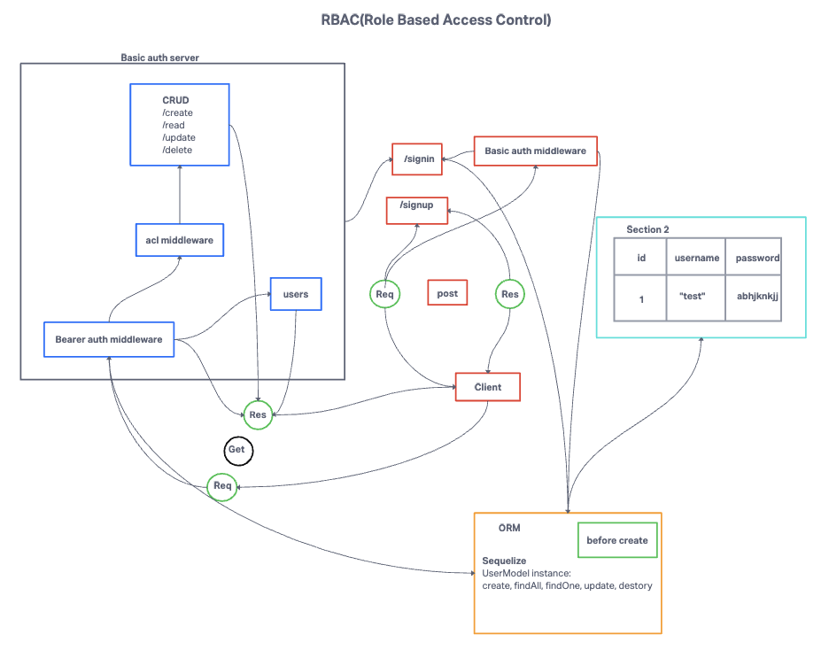

# Auth API

## Author: Tricia Sawyer

### Problem Domain

The goal of this project is to modularize existing code into a single server instance, enhancing code organization and maintainability.

### Setup

#### Environment Variables

Ensure you have the following environment variables set in your `.env` file:

- `PORT`: Port Number for the server.
- `DATABASE_URL`: URL to the running Postgres instance or database.
- `SECRET`: Secret key for JWT tokens.

#### Initializing and Running the Application

To set up and run the application, follow these steps:

1. Create a new repository for your project.
2. Add the provided starter code to your repository.
3. Run `npm install` to install project dependencies.
4. Run `npm run db:config` to generate a configuration file for your database. Edit the created config file with your database settings.
5. Run `npm run db:create` to create the database.
6. Start the application with `npm start`.

### Features and Routes

The application provides the following routes, with some requiring basic or bearer authentication:

- **GET** `/api/v2/food`: Retrieve all food records.
- **GET** `/api/v2/food/:id`: Retrieve a specific food record.
- **POST** `/api/v2/food`: Create or update a food record.
- **PUT** `/api/v2/food/:id`: Update a food record by ID.
- **PATCH** `/api/v2/food/:id`: Partially update a food record by ID.
- **DELETE** `/api/v2/delete`: Delete a food record.

### UML Diagram

